# 👨‍🎓 Customer API

## 📄 Student Information
- **Name:** Huỳnh Tuấn Anh
- **Student ID:** ITITIU23003
- **Class:** Web Application Development_Group01_lab03_Tue1234

## API Endpoints

### 💻 Base URL
`http://localhost:8080/api/customers`

### 🛠 Endpoints Implemented
- [x] GET /api/customers - Get all customers
- [x] GET /api/customers/{id} - Get by ID
- [x] POST /api/customers - Create customer
- [x] PUT /api/customers/{id} - Update customer
- [x] DELETE /api/customers/{id} - Delete customer
- [x] GET /api/customers/search?keyword={keyword} - Search
- [x] GET /api/customers/status/{status} - Filter by status
- [x] Pagination and sorting
- [x] PATCH for partial update
- [ ] Bonus features

## 🏃‍♀️ How to Run
1. Create database: `customer_management`
2. Update `application.properties` with your MySQL credentials
3. Run: `mvn spring-boot:run`
4. Test: Open Thunder Client or Postman
5. Import collection: `Customer_API.postman_collection.json`

## 🛠·Testing
All endpoints were tested with Thunder Client.
### GET all customers
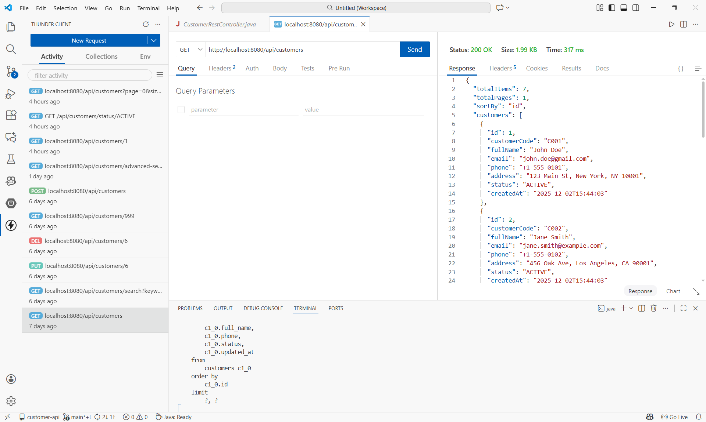
---
### ✏️ GET - Get customer by ID
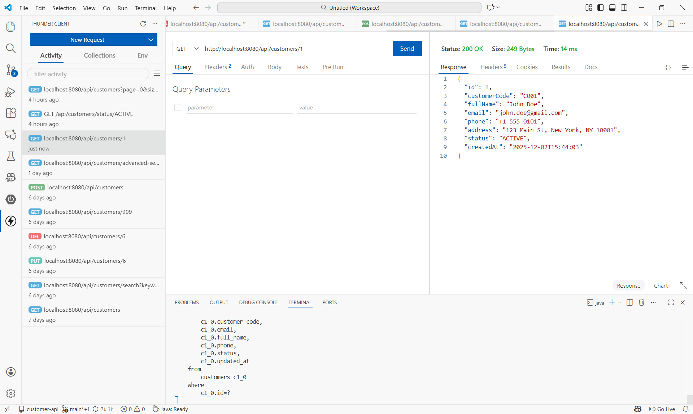
---
### ✏️ POST - Create customer
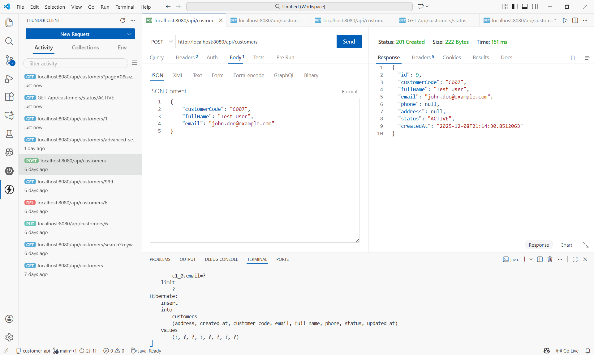
---
### ✏️ PUT - Update customer
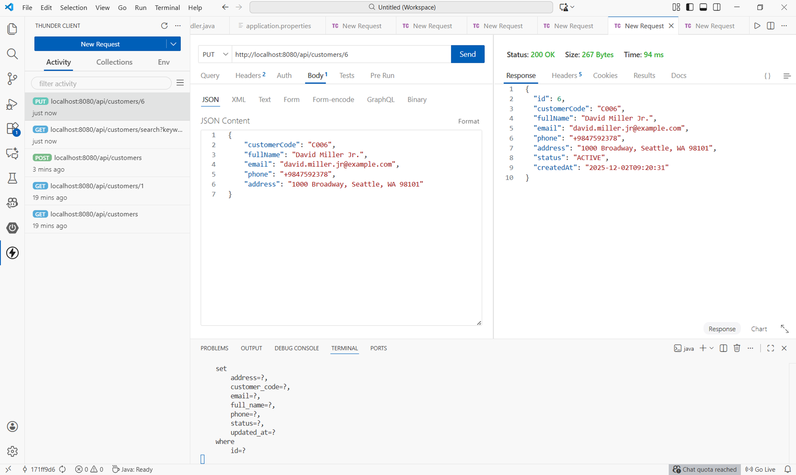
---
### ❌ DELETE - Delete customer
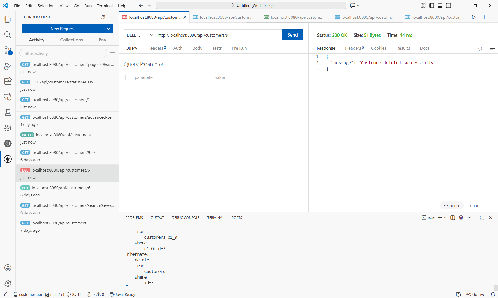
---
### ❗ Duplicate information (email or phone)
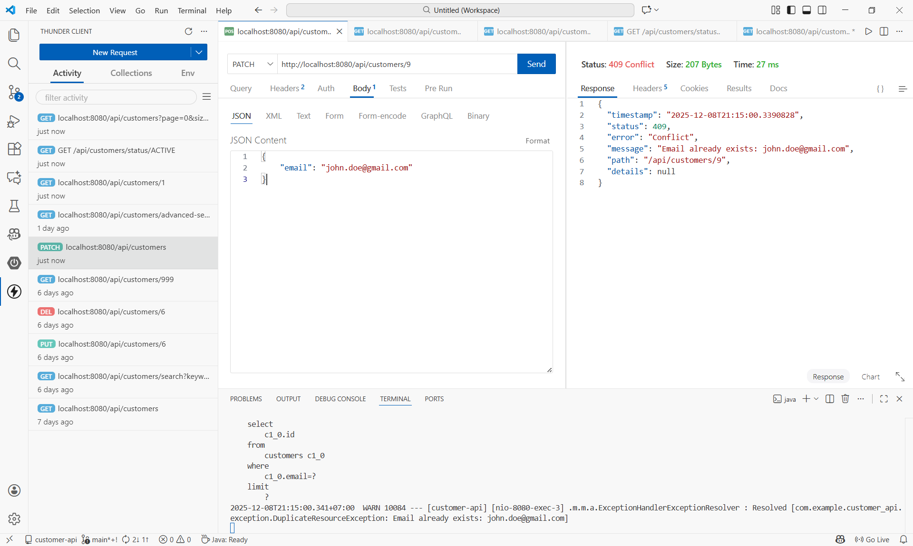
---
### 🧪 GET - Filter status = "ACTIVE"
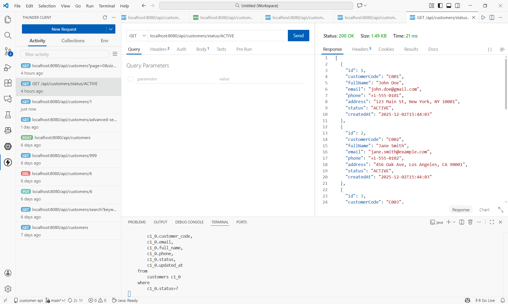
---
### 🧪 GET - Filter status = "INACTIVE"
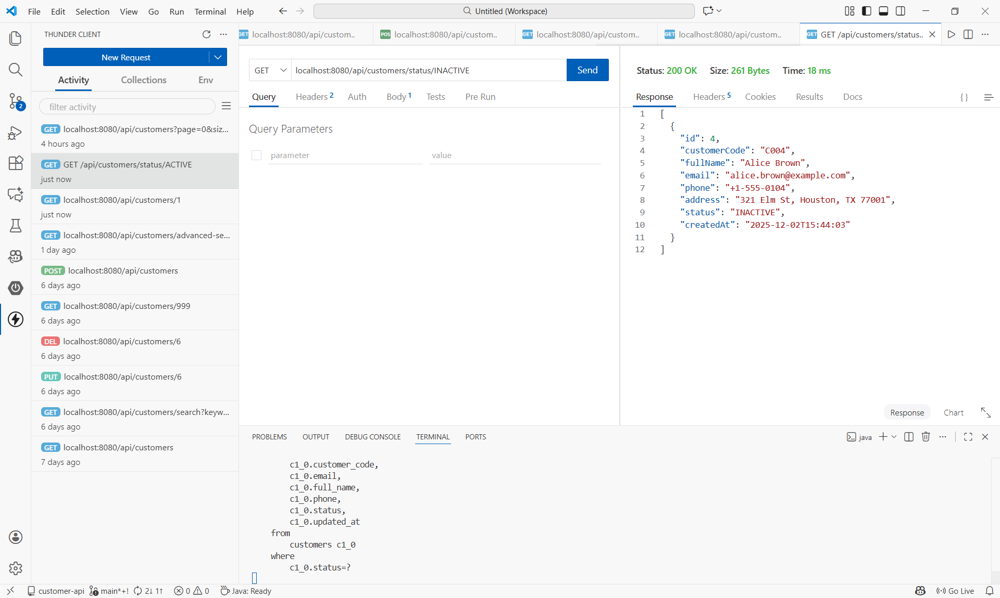
---
### 🔎 GET - Search with keyword = "john"
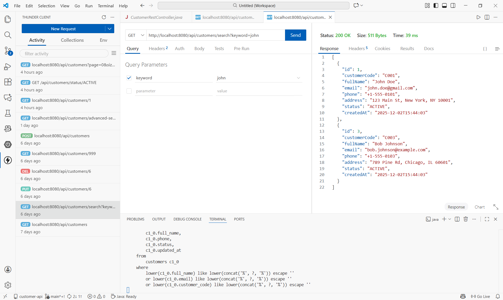
---
### 🔎 GET - Advanced search with keyword and status
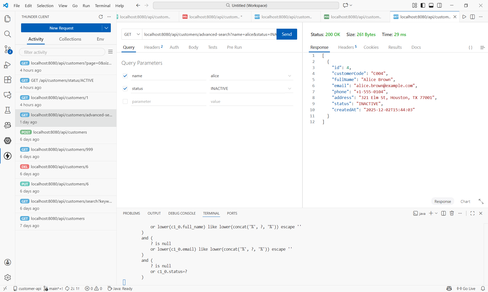
---
### 🔨 Resources not found
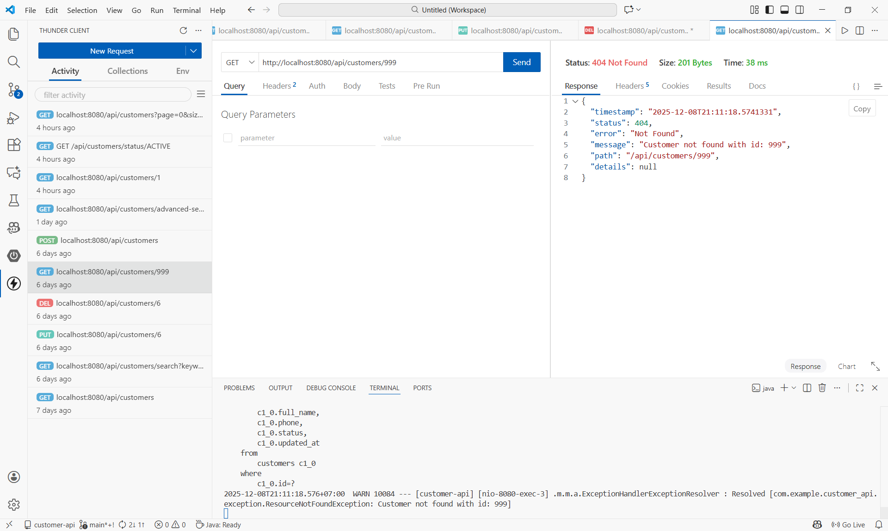
---
### 🔎 GET - Display pagination
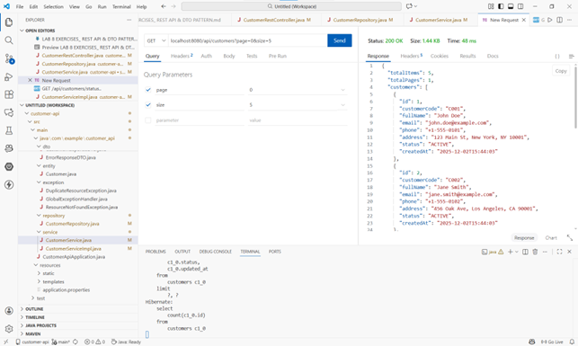
---
### 🧪 GET - Sorting
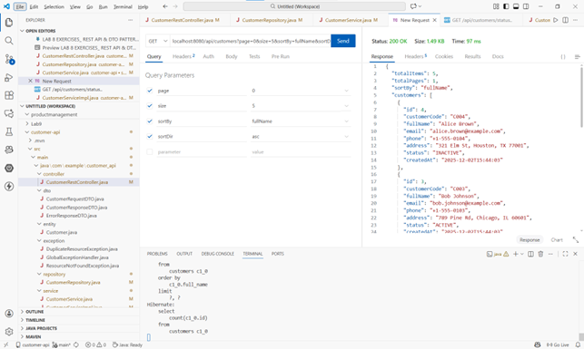
---
### 🧪 GET - Sorting with pagination
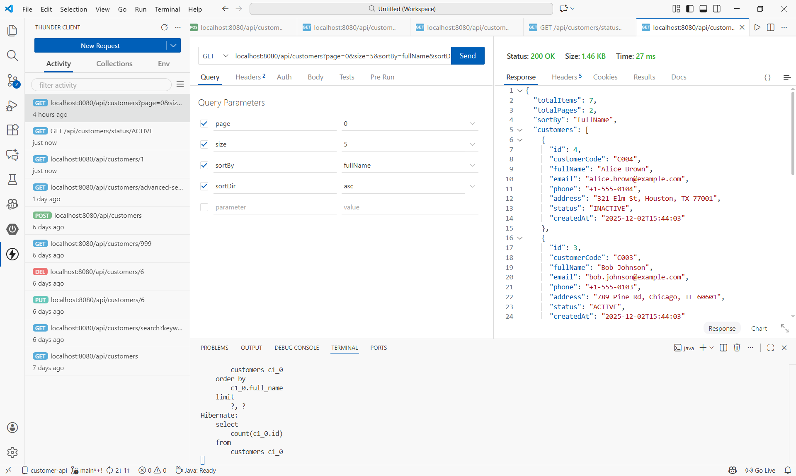
---
### ✔ Validation error checking
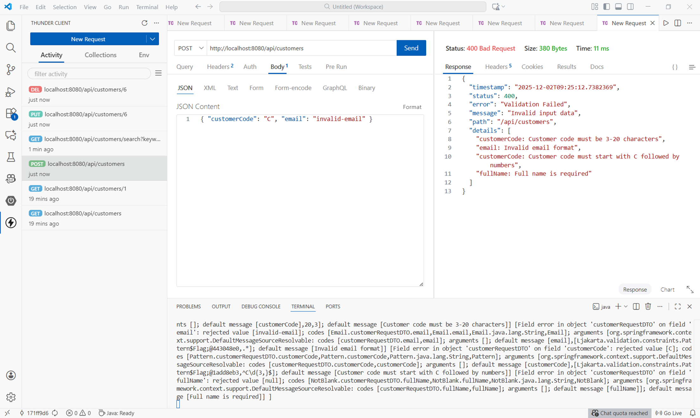
---
### 💡 PATCH - Partially updating information
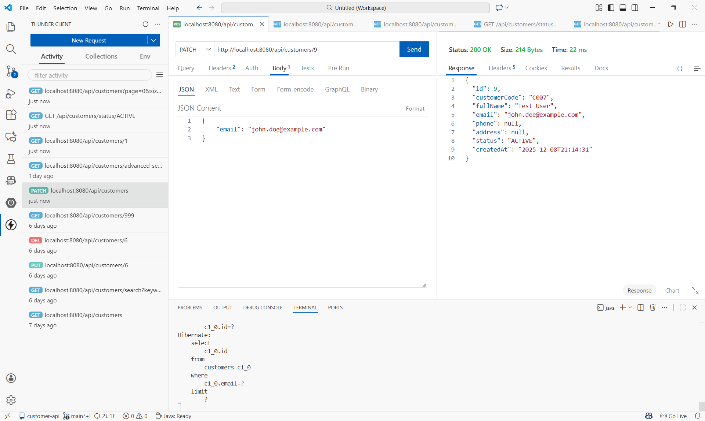
---

## Features Implemented
- DTO pattern for request/response
- Validation with @Valid
- Exception handling with @RestControllerAdvice
- Custom exceptions (404, 409)
- Proper HTTP status codes
- Search and filter
- Pagination
- Sorting

## ❗ Known Issues
- Take more time for understanding the API, its endpoints, and how to get the data with Thunder Client
- This is the first time that I've worked with Postman, so I need some time to get familiar to implement methods and export to JSON file.
- Understanding how the GET/POST/PATCH methods work deeply.
- Take more time to understand and create an API documentation.

## ⌚ Time Spent
Approximately 8 hours
